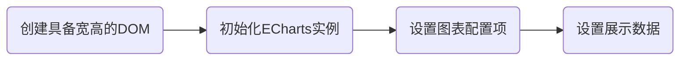

---

title: ECharts学习笔记

date: 2020-12-03 10:17:26

tags: [可视化]

---

本文旨在对数据可视化框架ECharts的文档进行梳理，同时结合网络流量分析项目给出自己的思考。

<!-- more -->

## 使用流程

### 导入ECharts

使用ECharts之前，需要将ECharts框架导入到工程项目中。ECharts支持使用标签的方式导入(`<script src="echarts.min.js">`)，同时也支持用户使用npm获取echarts。如果你的项目正在使用Vue、React等工程化框架，那么推荐使用npm作为导入ECharts的方式。

### 创建图表实例

ECharts图表实例的创建流程如下：

ECharts提供了setOption()函数来更新图形，每当该函数被调用时，ECharts会比较前后两次数据的差异，并使用合适的动画来呈现图形的变化。实际上，如果只是创建简单的图形，只需要根据需求修改对应的配置项即可。ECharts所有的配置项可以参考[ECharts文档-配置项](https://echarts.apache.org/zh/option.html#title)。

## 交互逻辑

### 自定义Toolbox

ECharts自带了toolbox帮助用户实现各种简单的交互逻辑：

- saveAsImage => 保存图片
- restore => 配置项还原
- dataView => 数据视图工具
- dataZoom => 数据区域缩放
- magicType => 动态类型切换
- brush 选择组件的控制按钮

除此之外，用户也可根据自己的需要添加toolbox按钮和对应的click响应事件。需要注意的是，添加到toolbox中的自定义feature均需要以my开头。

### 事件与行为

在网络流量分析项目中，对brush选框交互有着独特的需求。例如，需要限定用户最多只能刷选两次，每次的刷选框需要用不同的颜色标记，同时要在刷选框上方给出区间提示等。对于这种自定义的复杂交互逻辑，需要使用ECharts提供的events和actions接口解决。

#### 事件

ECharts主要通过on方法添加事件处理函数，所有的ECharts事件列表参考[ECharts文档-events](https://echarts.apache.org/zh/api.html#events)。

ECharts中的事件主要有两种，一种是鼠标事件（如鼠标单击、双击和悬浮等），一种是使用交互组件（如datazoom组件和brush组件）后触发的事件。鼠标事件可参考[ECharts文档-鼠标事件](https://echarts.apache.org/zh/api.html#events)，在此不再赘述。本文研究的重点是brush组件的交互事件，因此会对这部分内容进行详细的介绍。

brush组件是选框组件，适用于用户想要选择一段时间范围的情况。brush组件有三个重要的交互事件，分别是brush、brushEnd和brushselected事件。

- brush => 选框正在添加事件
- brushEnd => 选框添加完毕事件
- brushselected => 对外通知当前选择区域事件

默认情况下，刷选或移动选区时，会不断触发brushSeleted事件，这可能会导致页面性能问题。好在ECharts提供了防抖和节流的配置选项throttleDelay，用户可以根据自身需要设置触发阈值。

#### 行为

除了用户的交互操作，在程序里调用方法触发图表的行为即为action。在ECharts 3中通过调用myChart.dispatchAction({ type: '' })触发图表行为。和brush组件相关的action的使用方法可以参考[ECharts文档-action.brush](https://echarts.apache.org/zh/api.html#action.brush)。

- action.brush.brush => 刷选动作进行中触发，可设置或删除chart中的选框。
- action.brush.brushEnd => 刷选动作完毕时自动触发该action。
- action.brush.takeGlobalCursor => 将鼠标变更为可刷选状态。